# ROMV2

## Sommaire
- [Description](#description)
    - [Fonctionnalités](#fonctionnalités)
    - [Vidéo](#vidéo)
    - [Echelle de Bortle](#echelle-de-bortle)
- [Liste des pièces](#liste-des-pièces)
    - [Amazon](#amazon)
    - [Ali Express](#ali-express)
    - [Visserie & Divers](#visserie--divers)
- [Montage](#montage)
    - [Breadboard](#breadboard)
    - [PCB](#pcb)
    - [Boxes](#boxes)
    - [ESP32](#esp32)
    - [Capteurs](#capteurs)
    - [Optique du TSL2591](#optique-du-tsl2591)
- [Firmware](#firmware)
    - [Bibliothèques nécessaires à l'application](#bibliothèques-nécessaires-à-lapplication)
    - [Paramètres de l'application dans Arduino IDE](#paramètres-de-lapplication-dans-arduino-ide)
    - [Configuration de l'application](#configuration-de-lapplication)
    - [Configuration de l'écran TFT ST7735](#configuration-de-lécran-tft-st7735)
    - [Implémentation](#implémentation)
    - [Mode \"Debug\"](#mode-debug)
- [Utilisation](#utilisation)
    - [Matériel](#matériel)
    - [Calibration](#calibration)
    - [Mise en veille](#mise-en-veille)
    - [Logiciel](#logiciel)
        - [En-tête](#en-tête)
        - [Ecran d'accueil](#ecran-daccueil)
        - [Ecran Luminosité](#ecran-luminosité)
        - [Ecran Environnement](#ecran-environnement)
        - [Ecran Ir Température](#ecran-ir-température)
        - [Ecran Niveaux](#ecran-niveaux)
        - [Ecran GPS](#ecran-gps)
- [Driver ASCOM](#driver-ascom)

## Description
Le ROMV2 est un Sky Quality Meter (SQM) contenant les composants suivant :
- TSL2591
- MLX90614
- BME280
- ADXL345
- GPS NEO 8M
- TFT ST7735

<a href="#sommaire">Retour au sommaire</a>

### Fonctionnalités

- Lecture de la luminosité (full / ir / visible), calcul de la quantité de lux, du SQM et du Bortle.
- Moyenne mobile du lux sur 50 valeurs permettant de réduire l'incertitude mesurée. Calcul du SQM et du Bortle sur la moyenne mobile du lux. Possibilité de remise à zéro de la moyenne mobile.
- Réglage automatique de la sensibilité (1x, 25x, 428x, 9876x) et de la durée de mesure (100ms, 200ms, 300ms, 400ms, 500ms, 600ms) du capteur de luminosité TSL2591.
- Lecture de la qualité du ciel (3 états : ciel clair / peu nuageux / nuageux) via le capteur MLX90614 permettant la lecture de la température du ciel.
- Lecture des conditions d'environnement (Température, taux d'humidité, pression atmosphérique) via le capteur BME280.
- Calcul du point de rosée.
- Niveaux à bulle permettant de diriger l'optique vers le zénith grâce au capteur ADXL345.
- Coordonnées GPS et Date/Heure UTC issues du capteur GPS NEO 8M.
- Connection Bluetooth BLE.
- Driver ASCOM permettant de se connecter via Bluetooth BLE.
- Indicateur de mesure de luminosité en cours.
- Indicateur d'état d'une connection Bluetooth BLE client.
- Indicateur d'état du GPS.
- Indicateur de charge restante dans la batterie.
- Mise en veille de l'écran après 5 minutes d'inactivité ou sur demande.

<a href="#sommaire">Retour au sommaire</a>

### Vidéo

*TODO*

<a href="#sommaire">Retour au sommaire</a>

### Echelle de Bortle

Voici l'échelle de Bortle utilisée dans l'application.
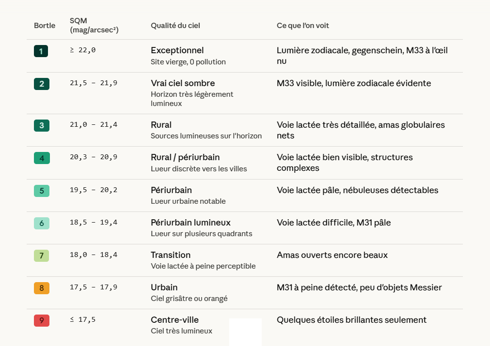

<a href="#sommaire">Retour au sommaire</a>

## Liste des pièces
### Amazon

| Composant | Prix | Nb. pièces | Prix unitaire |
| --- | --- | --- | --- |
| [ESP32 with Battery](https://www.amazon.fr/dp/B07YXFBFWF) | 18.77 € | 1 | 18.77 € |
| [TSL2591](https://www.amazon.fr/dp/B00XW2OFWW) | 15.10 € | 1 | 15.10 € |
| [BME280](https://www.amazon.fr/dp/B07HMQMW6M?th=1) | 30.99 € | 5 | 6.20 € |
| [ADXL345](https://www.amazon.fr/ADXL345-Acc%C3%A9l%C3%A9rom%C3%A8tres-Acc%C3%A9l%C3%A9rom%C3%A8tre-Num%C3%A9rique-Transmission/dp/B0CMHXKVFK/ref=sr_1_10) | 10.56 € | 5 | 2.12 € |
| [MLX90614](https://www.amazon.fr/dp/B07YXFKRQS) | 33.49 € | 2 | 16.75 € |
| [GPS NEO 8M](https://www.amazon.fr/ElectroWorldFR-Module-NEO-8M-antenne-c%C3%A9ramique/dp/B09TX372XH/ref=sr_1_1?dib=eyJ2IjoiMSJ9.GyMOXkPAdQJKi_ASPkseA7ipEurGyPBOK9iLMq7xFsxnnfKh-pcRWhYb2VR-S4IuEiChbY_t7W7bLJp7Eht2kMQDQ0xkvJzWRkWDQSkqXB5IoxJzVk7wV13RwX1YSmyawRRqvobqyPSSIGlcYiM0W9CYCON5QEQ_CDS9sm99N6rjFRnTDy8C2GoUfPZZ31fSykURqURjWuEuIMthyebSlJcXQy8YczkpN_mzAZ0U-5Vjem5UoTcflWjqjjbI-ESZ9PH-T0oc3jyTMx1Epk3qH9TRU3cjjBKE7-5wfiq0tyk.bl_Si2GKwsoPl7GtRpdT1Ig7CxPUBOhXHxNcevOB-uI&dib_tag=se&keywords=gps+neo+8m&qid=1775505172&sr=8-1) | 20.99 € | 1 | 20.99 € |
| [TFT ST7735](https://www.amazon.fr/AZDelivery-TFT-Compatible-Raspberry-incluant/dp/B07TJGF8HS/ref=sr_1_1) | 27.99 € | 5 | 5.60 € |
| [Lentille D23 F30](https://www.amazon.fr/Lentille-biconvexe-Double-Convexe-Optique/dp/B0GVHDZD22/ref=sr_1_1?__mk_fr_FR=%C3%85M%C3%85%C5%BD%C3%95%C3%91&crid=3MADED3FA8ZSP&dib=eyJ2IjoiMSJ9.OHaKf0gooWpe2pzlvtI_Wbqh3tUF_zsnCt_tyU0e8-_4IbmjT0l9vAKd0rLrE1OrlCwvQbDqu72_jyRH0t3bS1z0xB59mXZAWjSBM__FSi3vJUjFeU0uMK_6nFDuCDKvVm-S96p8WlbbNpI9qIfZXSfb4r7NqM91busSUx9ycR8x3oWYM2iyibWY5aZoE58Bab8oVxBvNVLl-2T9j1VuB3Z131tj-f9qxnXdHP7Iuh-ZriR4ovuB7IR4c-DYDU4AA9WParQ9YtdJsOEMJa2b0UnheVosP73wgMJ_1YHg3LM.V_IX7P2GysQskCdXQt859xpC8ZYireZWdn4w685vDlE&dib_tag=se&keywords=Lentille%2BD23%2BF30&qid=1775503466&sprefix=lentille%2Bd23%2Bf30%2Caps%2C263&sr=8-1&th=1) | 25.94 € | 1 | 25.94 € |
| [Joystick](https://www.amazon.fr/Gebildet-Joystick-Commande-Contr%C3%B4leur-Raspberry/dp/B0DPMN19G6/ref=sr_1_1_sspa) | 10.99 € | 8 | 1.37 € |
| [Boot Button](https://www.amazon.fr/dp/B07S1MNB8C) | 10.99 € | 5 | 2.20 € |
| [Interrupteur à bascule](https://www.amazon.fr/dp/B076VKRKQQ) | 6.49 € | 5 | 1.30 € |
| [Rallonge Micro USB](https://www.amazon.fr/dp/B08HCTZ9P5) | 11.79 € | 2 | 5.90 € |
| [Testeur de capacité](https://www.amazon.fr/dp/B0DKHT664R) | 13.19 € | 4 | 3.30 € |
| | | Total | **125.54 €** |

<a href="#sommaire">Retour au sommaire</a>

### Ali Express
| Composant | Prix | Nb. pièces | Prix unitaire |
| --- | --- | --- | --- |
| [ESP32 with Battery](https://fr.aliexpress.com/item/1005007579177706.html) | 4.19 € | 1 | 4.19 € |
| [TSL2591](https://fr.aliexpress.com/item/1005009290610834.html) | 4.19 € | 1 | 4.19 € |
| [BME280](https://fr.aliexpress.com/item/1005010256393146.html?spm=a2g0o.productlist.main.2.78b7sYvrsYvrNW&aem_p4p_detail=202601100917361994442904015680011727029&algo_pvid=664d5010-2f7d-4243-b81e-0bd71b7036e1&algo_exp_id=664d5010-2f7d-4243-b81e-0bd71b7036e1-1&pdp_ext_f=%7B%22order%22%3A%2213%22%2C%22eval%22%3A%221%22%2C%22fromPage%22%3A%22search%22%7D&pdp_npi=6%40dis%21EUR%213.03%212.99%21%21%2124.07%2123.73%21%40211b615317680654560714990e4974%2112000051694170064%21sea%21FR%210%21ABX%211%210%21n_tag%3A-29910%3Bd%3A268baa35%3Bm03_new_user%3A-29895&curPageLogUid=KpQ950JoFBly&utparam-url=scene%3Asearch%7Cquery_from%3A%7Cx_object_id%3A1005010256393146%7C_p_origin_prod%3A&search_p4p_id=202601100917361994442904015680011727029_1) | 2.99 € | 1 | 2.99 € |
| [ADXL345](https://fr.aliexpress.com/item/1005007076396937.html?spm=a2g0o.productlist.main.2.1b7178978prMu0&aem_p4p_detail=20260110092034382346930602350009392653&algo_pvid=979b2a20-a6c3-436e-a181-ca2a512da107&algo_exp_id=979b2a20-a6c3-436e-a181-ca2a512da107-1&pdp_ext_f=%7B%22order%22%3A%2210%22%2C%22eval%22%3A%221%22%2C%22fromPage%22%3A%22search%22%7D&pdp_npi=6%40dis%21EUR%212.04%210.99%21%21%2116.18%217.85%21%4021039a5b17680656340051574e6e31%2112000039321883527%21sea%21FR%210%21ABX%211%210%21n_tag%3A-29910%3Bd%3A268baa35%3Bm03_new_user%3A-29895%3BpisId%3A5000000197682679&curPageLogUid=0sydmJMToagN&utparam-url=scene%3Asearch%7Cquery_from%3A%7Cx_object_id%3A1005007076396937%7C_p_origin_prod%3A&search_p4p_id=20260110092034382346930602350009392653_1) | 2.04 € | 1 | 2.04 € |
| [MLX90614](https://fr.aliexpress.com/item/1005005964068723.html?spm=a2g0o.productlist.main.4.2da25a797lce6r&algo_pvid=96472eaa-5bcc-412b-9cea-689f60105c19&algo_exp_id=96472eaa-5bcc-412b-9cea-689f60105c19-3&pdp_ext_f=%7B%22order%22%3A%2270%22%2C%22eval%22%3A%221%22%2C%22fromPage%22%3A%22search%22%7D&pdp_npi=6%40dis%21EUR%215.93%211.93%21%21%216.74%212.19%21%40211b876e17680657663371515e4d86%2112000035077198277%21sea%21FR%210%21ABX%211%210%21n_tag%3A-29910%3Bd%3A268baa35%3Bm03_new_user%3A-29895%3BpisId%3A5000000197682679&curPageLogUid=nmUgJJeUAuYu&utparam-url=scene%3Asearch%7Cquery_from%3A%7Cx_object_id%3A1005005964068723%7C_p_origin_prod%3A) | 5.93 € | 1 | 5.93 € |
| [GPS NEO 8M](https://fr.aliexpress.com/item/1005006323393609.html?spm=a2g0o.productlist.main.3.5baaF3dXF3dXN6&algo_pvid=d358f8e7-a8c4-4330-bd75-5c9c0d9cf0fd&algo_exp_id=d358f8e7-a8c4-4330-bd75-5c9c0d9cf0fd-2&pdp_ext_f=%7B%22order%22%3A%2243%22%2C%22spu_best_type%22%3A%22price%22%2C%22eval%22%3A%221%22%2C%22fromPage%22%3A%22search%22%7D&pdp_npi=6%40dis%21EUR%213.69%210.99%21%21%2129.30%217.85%21%40211b6c1717680658512117875e9001%2112000036760961133%21sea%21FR%210%21ABX%211%210%21n_tag%3A-29910%3Bd%3A268baa35%3Bm03_new_user%3A-29895%3BpisId%3A5000000197682689&curPageLogUid=795nKb0Msi8Z&utparam-url=scene%3Asearch%7Cquery_from%3A%7Cx_object_id%3A1005006323393609%7C_p_origin_prod%3A) | 9.29 € | 1 | 9.29 € |
| [TFT ST7735](https://fr.aliexpress.com/item/1005008974306385.html?spm=a2g0o.productlist.main.1.69deN3sMN3sMCK&aem_p4p_detail=20260110092555980857702899360011928963&algo_pvid=6bee107f-34fa-4179-b0e6-e06063f523cd&algo_exp_id=6bee107f-34fa-4179-b0e6-e06063f523cd-0&pdp_ext_f=%7B%22order%22%3A%22201%22%2C%22eval%22%3A%221%22%2C%22fromPage%22%3A%22search%22%7D&pdp_npi=6%40dis%21EUR%213.20%210.99%21%21%2125.40%217.84%21%402103847817680659550071490e715d%2112000047425743978%21sea%21FR%210%21ABX%211%210%21n_tag%3A-29910%3Bd%3A268baa35%3Bm03_new_user%3A-29895%3BpisId%3A5000000197682689&curPageLogUid=xHHqy2YoAtyq&utparam-url=scene%3Asearch%7Cquery_from%3A%7Cx_object_id%3A1005008974306385%7C_p_origin_prod%3A&search_p4p_id=20260110092555980857702899360011928963_1) | 3.20 € | 1 | 3.20 € |
| [Lentille D23 F30](https://fr.aliexpress.com/item/1005007033633969.html?spm=a2g0o.order_list.order_list_main.5.15905e5bGzuWd4&gatewayAdapt=glo2fra) | 2.06 € | 1 | 2.06 € |
| [Joystick](https://fr.aliexpress.com/item/1005009123774307.html?spm=a2g0o.productlist.main.2.844571abghArQ0&aem_p4p_detail=202601100928134145830235804040011530309&algo_pvid=89fbdaf8-fb4d-49ac-9e4e-6c98ab33126b&algo_exp_id=89fbdaf8-fb4d-49ac-9e4e-6c98ab33126b-1&pdp_ext_f=%7B%22order%22%3A%22158%22%2C%22eval%22%3A%221%22%2C%22fromPage%22%3A%22search%22%7D&pdp_npi=6%40dis%21EUR%210.51%210.51%21%21%210.58%210.58%21%402103956b17680660932575051e4923%2112000047996600701%21sea%21FR%210%21ABX%211%210%21n_tag%3A-29910%3Bd%3A268baa35%3Bm03_new_user%3A-29895&curPageLogUid=1X7S3y0vz51t&utparam-url=scene%3Asearch%7Cquery_from%3A%7Cx_object_id%3A1005009123774307%7C_p_origin_prod%3A&search_p4p_id=202601100928134145830235804040011530309_1) | 0.51 € | 1 | 0.51 € |
| [Boot Button](https://fr.aliexpress.com/item/1005007876916629.html?spm=a2g0o.productlist.main.10.73ef397fSy3LUu&aem_p4p_detail=202601100929212620692040343560011023458&algo_pvid=85067849-ce96-40d4-bcf8-23d93fe938f9&algo_exp_id=85067849-ce96-40d4-bcf8-23d93fe938f9-9&pdp_ext_f=%7B%22order%22%3A%2214%22%2C%22eval%22%3A%221%22%2C%22fromPage%22%3A%22search%22%7D&pdp_npi=6%40dis%21EUR%217.89%217.89%21%21%2162.62%2162.62%21%40211b819117680661610895672e553c%2112000042664114951%21sea%21FR%210%21ABX%211%210%21n_tag%3A-29910%3Bd%3A268baa35%3Bm03_new_user%3A-29895&curPageLogUid=isVvfGSpx5wR&utparam-url=scene%3Asearch%7Cquery_from%3A%7Cx_object_id%3A1005007876916629%7C_p_origin_prod%3A&search_p4p_id=202601100929212620692040343560011023458_10) | 6.69 € | 5 | 1.34 € |
| [Interrupteur à bascule](https://fr.aliexpress.com/item/1005010311259797.html?spm=a2g0o.order_list.order_list_main.60.15905e5bGzuWd4&gatewayAdapt=glo2fra) | 1.65 € | 10 | 0.17 € |
| [Rallonge Micro USB](https://fr.aliexpress.com/item/1005005292730047.html?spm=a2g0o.productlist.main.7.6f42HjGaHjGaxe&algo_pvid=c172c99a-1684-4c49-aed9-8e433b4ffc45&algo_exp_id=c172c99a-1684-4c49-aed9-8e433b4ffc45-6&pdp_ext_f=%7B%22order%22%3A%22318%22%2C%22eval%22%3A%221%22%2C%22fromPage%22%3A%22search%22%7D&pdp_npi=6%40dis%21EUR%211.09%211.09%21%21%211.22%211.22%21%40211b430817755040764844407e8122%2112000032517243029%21sea%21FR%217117391439%21X%211%210%21n_tag%3A-29919%3Bd%3A73ad8745%3Bm03_new_user%3A-29895&curPageLogUid=svWuhULTk2Nb&utparam-url=scene%3Asearch%7Cquery_from%3A%7Cx_object_id%3A1005005292730047%7C_p_origin_prod%3A) | 1.09 € | 1 | 1.09 € |
| [Testeur de capacité](https://fr.aliexpress.com/item/1005006350742151.html) | 1.45 € | 1 | 1.45 € |
| | | Total | **38.45 €** |

<a href="#sommaire">Retour au sommaire</a>

### Visserie & Divers

| Composant | Propriétés | Quantité |
| --- | --- | --- |
| Vis & rondelles | M4 x 20mm | 8 |
| Vis & rondelles | M2 x 20mm | 4 |
| Vis & rondelles | M2 x 8mm | 17 |
| Vis & rondelles | M2 x 6mm | 8 |
| Ecrou Nylstop autobloquants | M2 | 3 |
| Condensateur | 100 µF | 1 |
| Condensateur céramique | 100 nF | 1 |
| [PCB EPLZON](https://www.amazon.fr/dp/B0B5DCHM7K) | ... | 1 |
| [Câbles Dupont](https://www.amazon.fr/Breadboard-Jumper-Wires-Dupont-Cable/dp/B0BTT48V7P) | ... | ... |
| [PCB Vis Connecteur](https://www.amazon.fr/dp/B082ZNRQMJ?th=1) | ... | ... |
| [Jumper Breadboard](https://www.amazon.fr/dp/B0F6LJS4L2?ref=ppx_yo2ov_dt_b_fed_asin_title) | ... | ... |
| [Pile Rechargeable 18650](https://bestpiles.fr/piles-rechargeables-18650/991-pile-rechargeable-18650-inr18650mj1-li-ion-37v-3500mah-10a-8438493099829.html) | Li-ion 3,7V 3500mAh 10A | 1 |

<a href="#sommaire">Retour au sommaire</a>

## Montage

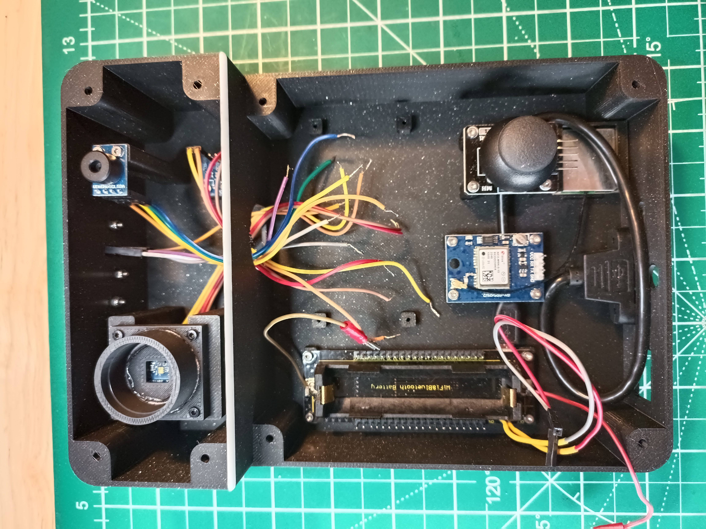

<a href="#sommaire">Retour au sommaire</a>

### Breadboard
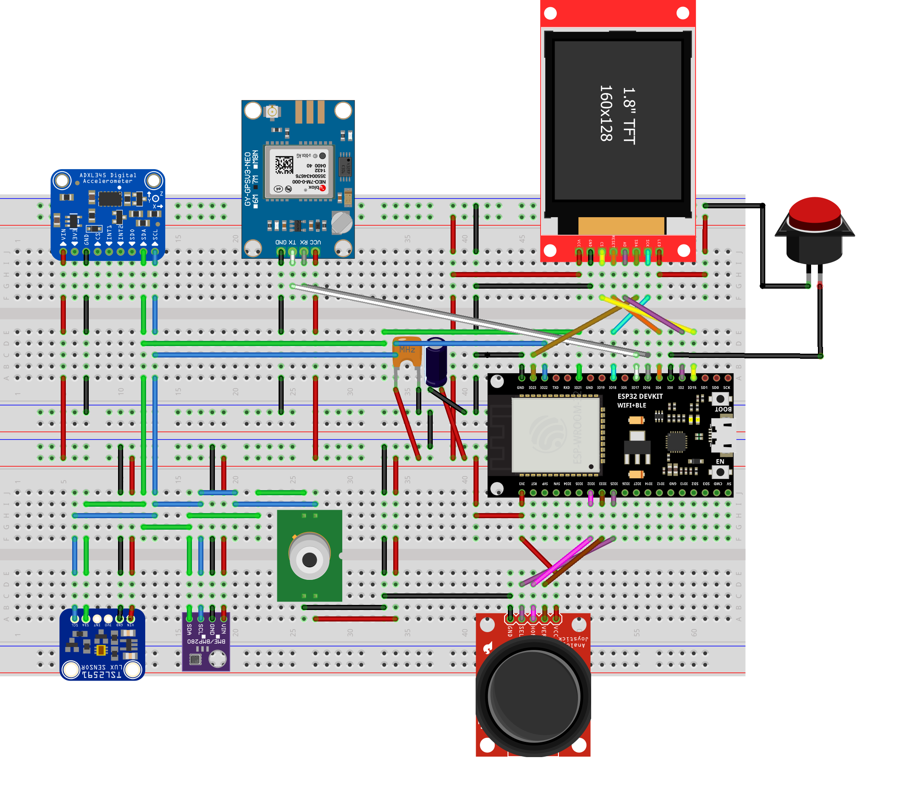

<a href="#sommaire">Retour au sommaire</a>

### PCB
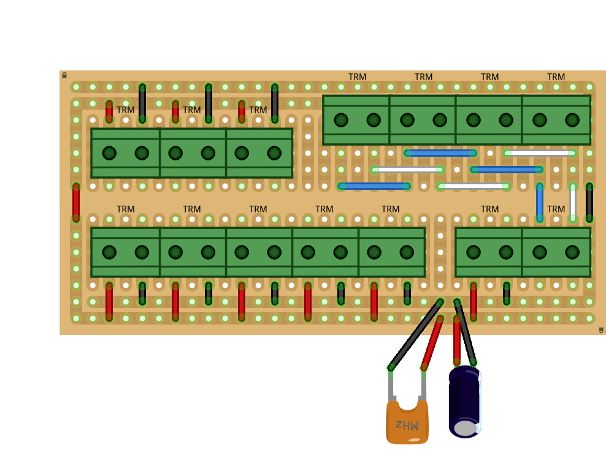
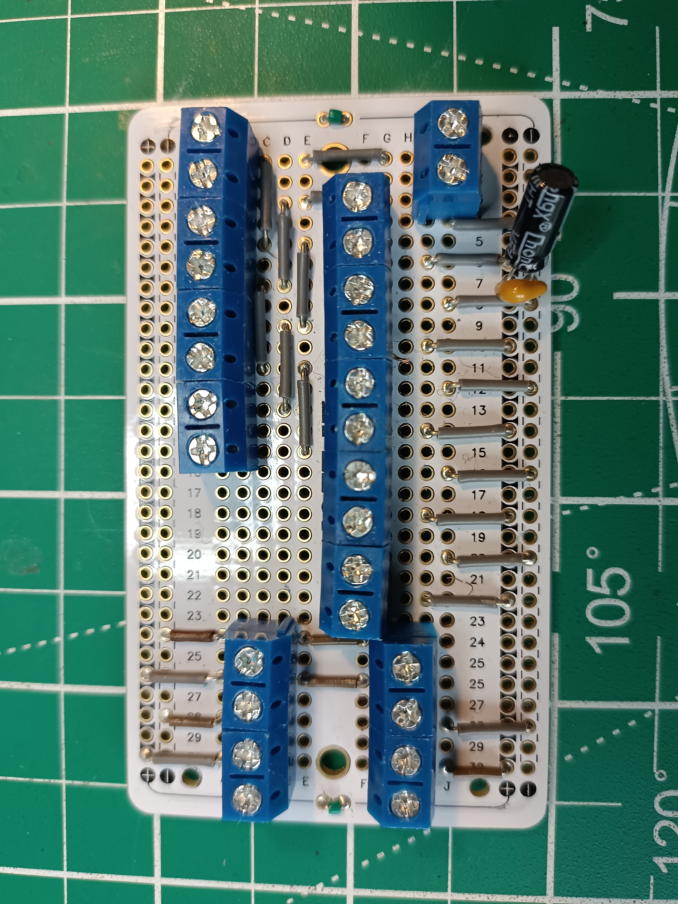

<a href="#sommaire">Retour au sommaire</a>

### Boxes
Vous trouverez dans [ce dossier](boxes) tous les fichiers STL nécessaires à l'impression 3D.

<a href="#sommaire">Retour au sommaire</a>

### ESP32
Des branchements direct sur l'ESP32 sont nécessaires :
- 2 câbles Dupont branchés directement sur l'interrupteur de l'ESP et connectés à l'interrupteur du ROM.
- 2 câbles branchés sur les pôles + et - de l'ESP et connectés à l'indicateur de charge restante de la batterie.

> [!WARNING]
> Attention, le connecteur micro USB présent sur l'ESP est très très fragile (j'en ai personnellement cassé plusieurs sur d'autres projets en faisant des branchements). Je vous conseil donc de rajouter 2 points de soudure de partet d'autre du connecteur  afin d'augementer sa solidité.

<a href="#sommaire">Retour au sommaire</a>

### Capteurs
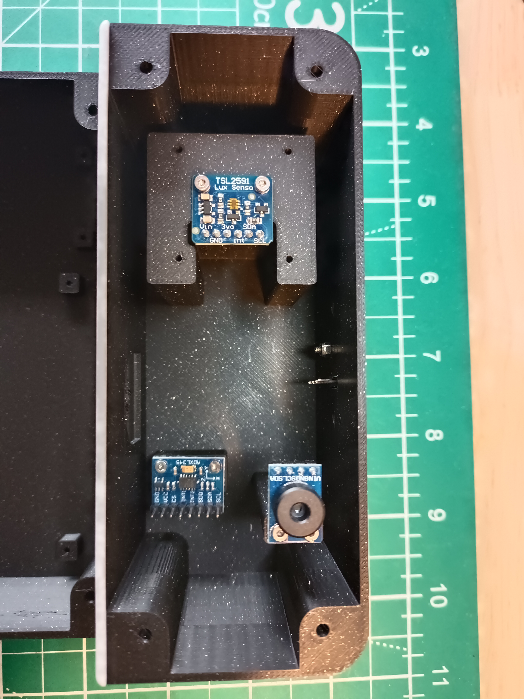
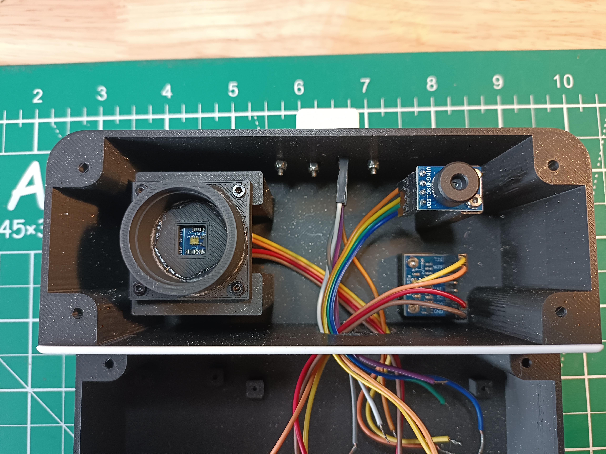

<a href="#sommaire">Retour au sommaire</a>

#### Optique du TSL2591
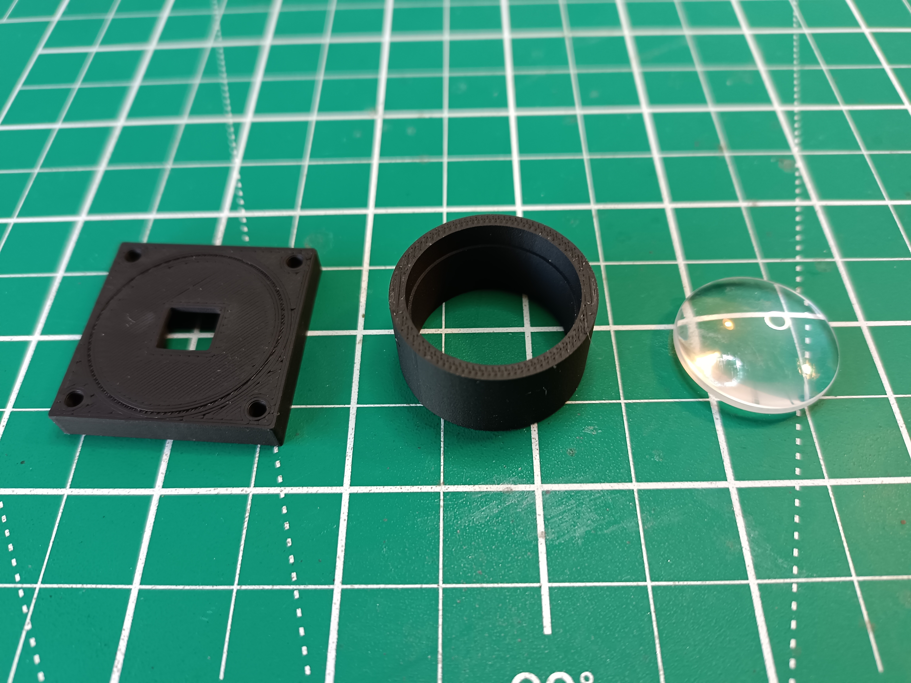
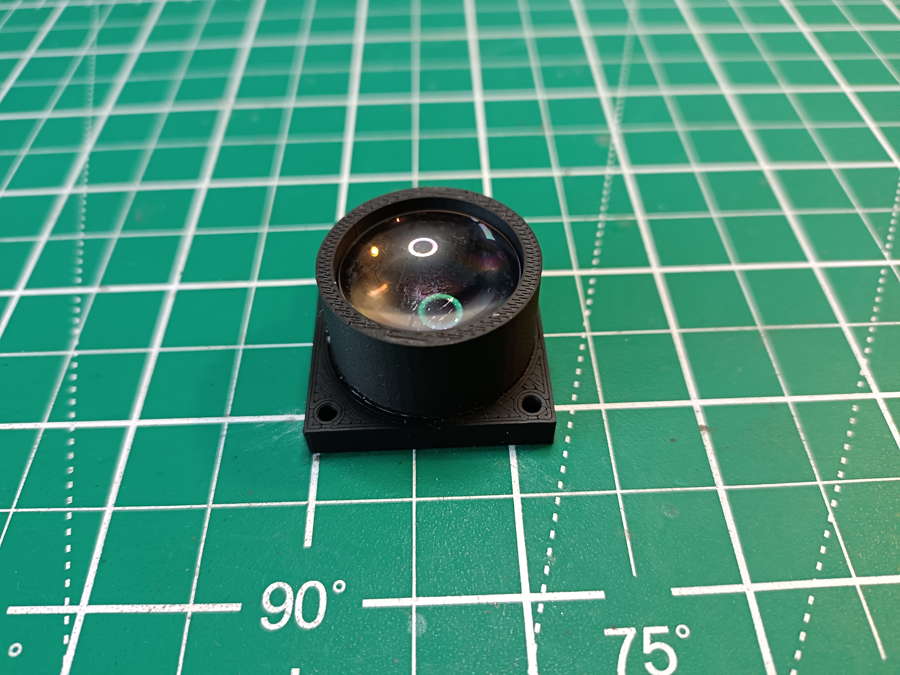
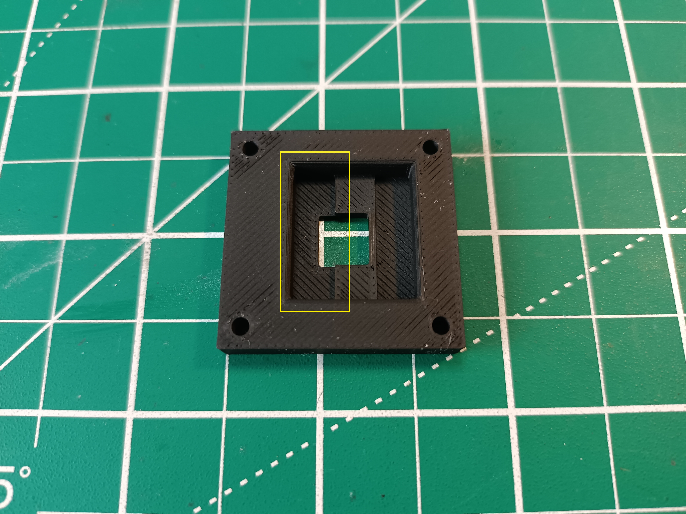

> [!WARNING]
> La partie encadrée en jaune correspond au côté des vis du TSL2591.

> [!TIP]
> La lentille est optionnelle. Vous pouvez uniquement positionner le cache du capteur et le tube sans la lentille. Vous pourrez ensuite corriger la [calibration](#calibration) si nécessaire.

<a href="#sommaire">Retour au sommaire</a>

## Firmware

- Télécharger le fichier **ROMV2_Firmware.zip**
- Depuis votre Arduino IDE, installer la bibliothèque **ROMV2**, en sélectionnant le fichier téléchargé via le menu : \
Croquis -> Importer une bibliothèque -> Ajouter la bibliothèque .ZIP ...
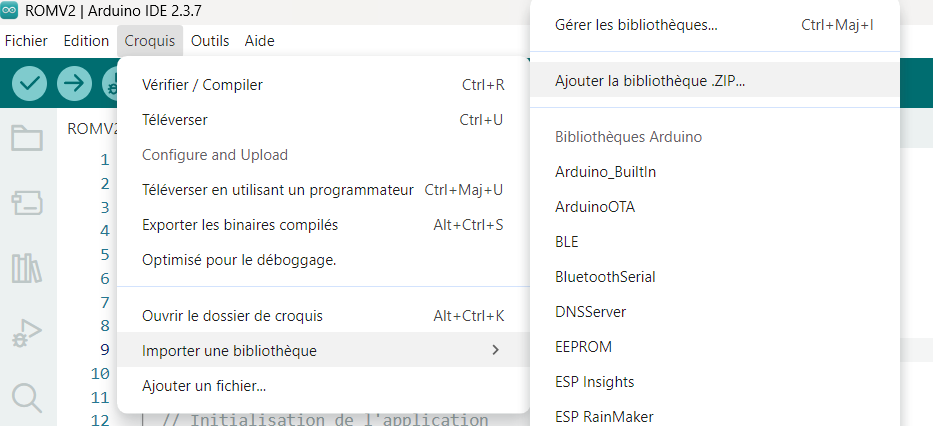

<a href="#sommaire">Retour au sommaire</a>

### Bibliothèques nécessaires à l'application
Voici la liste des bibliothèques utilisées par l'application que vous devez installer via le gestionnaire de librairies dans votre Arduino IDE :

- Adafruit_TSL2591
- Adafruit_BME280
- Adafruit_MLX90614
- Adafruit_ADXL345
- TFT_eSPI

<a href="#sommaire">Retour au sommaire</a>

### Paramètres de l'application dans Arduino IDE

> [!WARNING]
> Attention : l'application nécessite de se positionner en mode "Huge App" (cf. image ci-dessous), permettant ainsi de disposer de l'espace mémoire suffisant pour le fonctionnement sur l'ESP32.

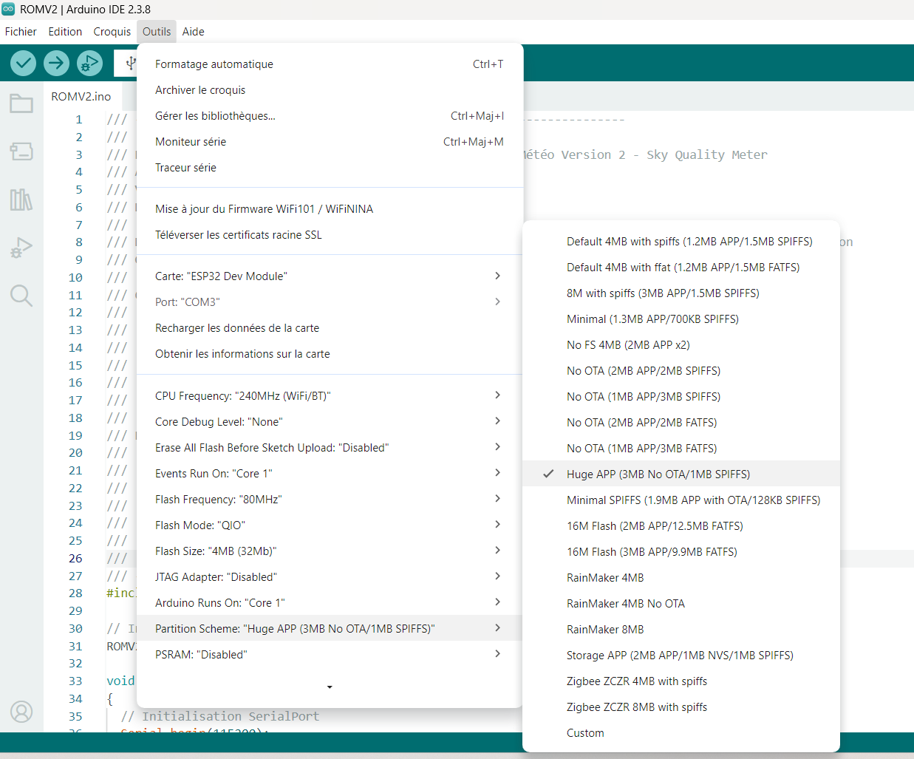

<a href="#sommaire">Retour au sommaire</a>

### Configuration de l'application
Vous pouvez accéder à la configuration de l'application via le fichier suivant : \
\<*Arduino librairies*\> -> ROMV2 -> src -> **ROMV2_APP_CONFIG.h**
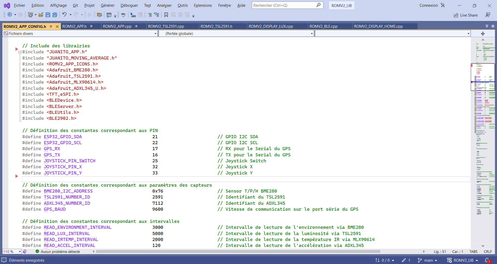

<a href="#sommaire">Retour au sommaire</a>

### Configuration de l'écran TFT ST7735
Afin de faire fonctionner votre écran, il vous sera nécessaire de le configurer via la bibliothèque **TFT_eSPI** en modifiant le fichier suivant : \
\<*Arduino librairies*\> -> TFT_sSPI -> **User_Setup.h**

Vous devez modifier 2 paramètres :

- La sélection de votre écran :
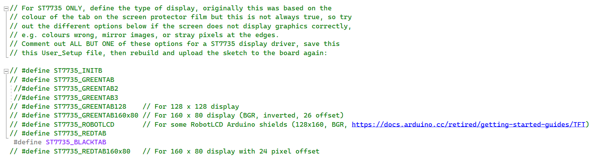
- Les PINs associés à votre écran :

<a href="#sommaire">Retour au sommaire</a>

### Implémentation
Pour démarrer un nouveau projet ROMV2, il vous suffit d'aller dans les examples de votre Arduino IDE, et de sélectionner **ROMV2**.

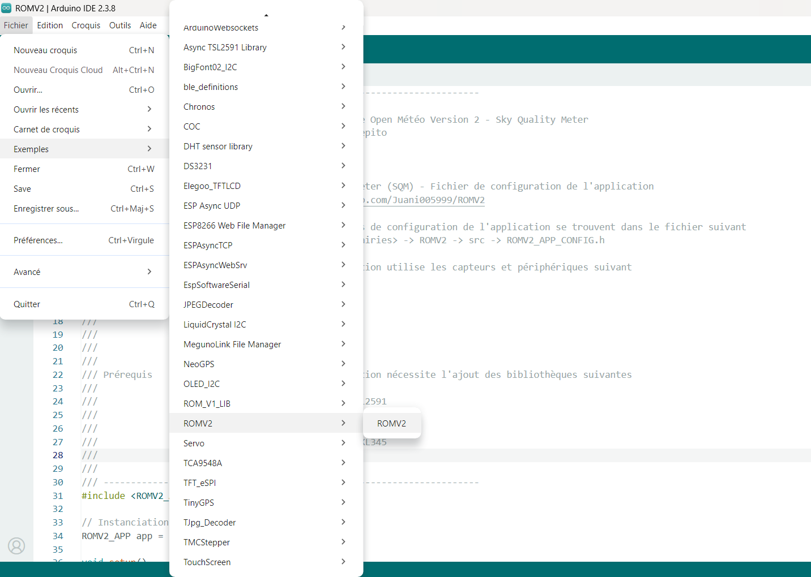

<a href="#sommaire">Retour au sommaire</a>

### Mode \"Debug\"
Pendant le développement de votre projet, vous pouvez activer le mode **Debug**. Afin d'améliorer les performances, **n'oubliez pas de le désactiver une fois le fois le projet abouti**.

Dans le fichier suivant : \
\<*Arduino librairies*\> -> ROMV2 -> src -> **JUANITO_APP.h** \
Enlevez les commentaires devant la ligne : \
`#define DEBUG`

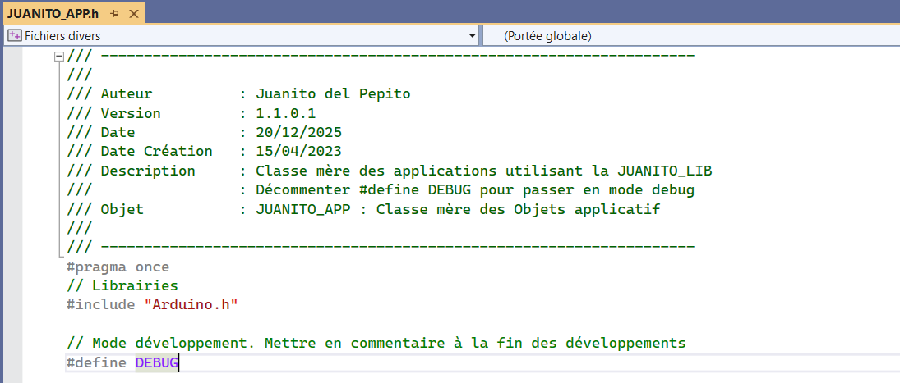

En activant le mode **Debug**, vous pourrez voir les traces de l'application dans le *Moniteur série* de votre *Arduino IDE* pendant l'exécution. 

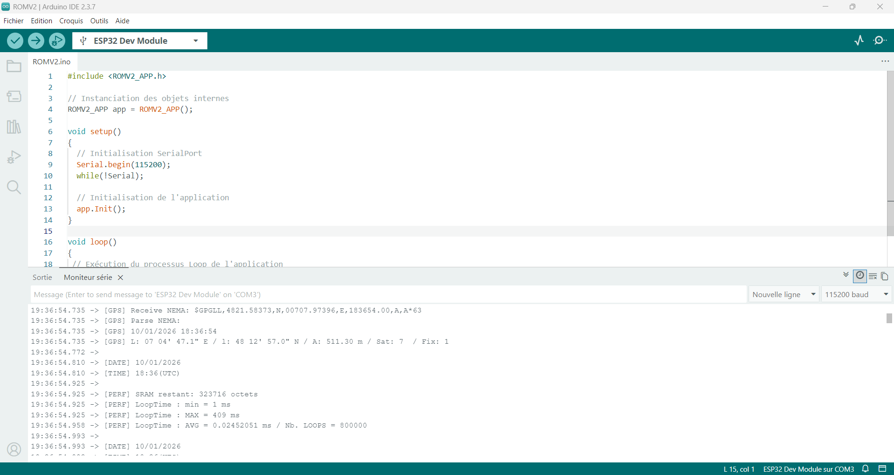

<a href="#sommaire">Retour au sommaire</a>

## Utilisation

### Matériel
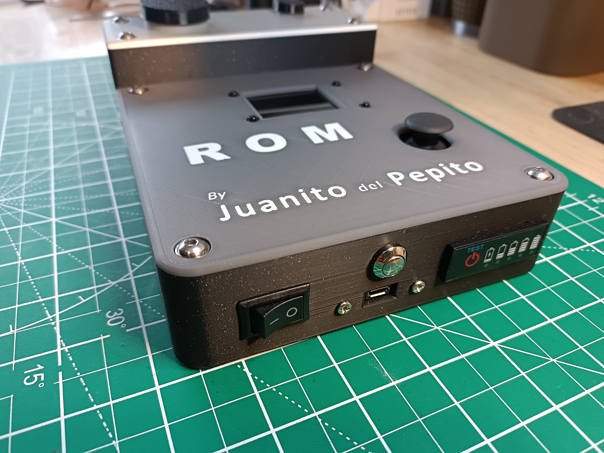

Vous trouverez au bas du ROM V2 :
- l'interrupteur On/Off de l'appareil.
- 1 connecteur Micro USB permettant de recharger le ROM V2 et servant également à la mise à jour du firmware.
- 1 interrupteur (bouton poussoir) permettant de mettre l'ESP en mode Boot lors de la mise à jour du firmware.
- L'indicateur de charge restante dans la batterie. Appuyez sur le bouton 'TEST' de l'indicateur pour connaître la charge restante.

Le pilotage du ROM V2 s'effectue via le joystick :
- Droite et gauche permettent de naviguer parmis les différents écrans.
- Haut et Bas permettent un retour direct à l'écran d'accueil.
- Sur l'écran d'acceuil, un clic sur le joystick permet d'alterner l'affichage Lux et SQM.
- Sur l'écran de luminosité, un clic sur le joystick permet de réinitialiser la moyenne mobile en cours.
- Un clic long sur le joystick permet de basculer l'écran en mode veille.

<a href="#sommaire">Retour au sommaire</a>

### Calibration

Dans le fichier de configuration, vous trouverez une constante définie permettant de calibrer le ROM V2 dans sa lecture de luminosité via le TSL2591.
La constante de calibration est : `TSL2591_CALIBRATION`

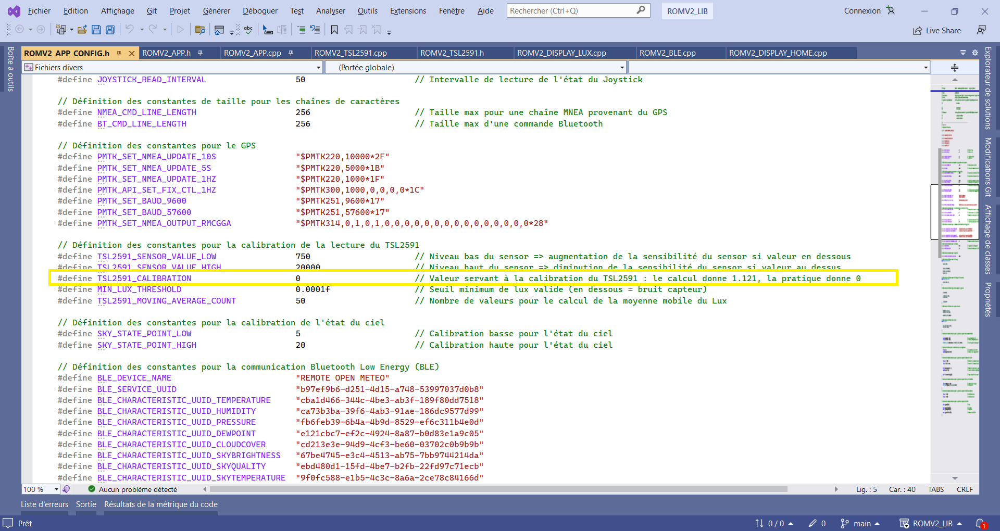

> [!TIP]
> La calibration nécessaire avec la lentille donne par le calcul une valeure de 1.121, mais dans la pratique, la valeure de 0 donne des résultats plus cohérents. Vous pouvez également donner des valeurs négatives si nécessaire.

<a href="#sommaire">Retour au sommaire</a>

### Mise en veille

L'écran du ROM V2 s'éteint automatiquement après 5 min d'inactivité (modifiable dans le fichier de configuration).
Cette mise en veille peut être déclenchée à tout moment par un "click long" sur le joystick.

Pour sortir du mode veille, il suffit d'effectuer une action sur le joystick, peut importe laquelle.

<a href="#sommaire">Retour au sommaire</a>

### Logiciel

Le firmware est constitué de 6 écrans, avec un en-tête commun à tous les écrans.

#### En-tête

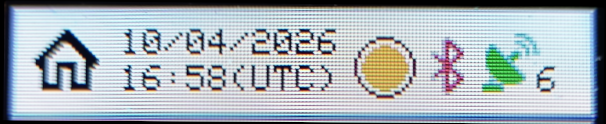

L'en-tête comprend les éléments suivants :
- Un icone principal spécifique à l'écran en cours d'affichage.
- La date et l'heure UTC remontée par le capteur GPS.
- Un icone indiquant qu'une prise de mesure de la luminosité est en cours.
- Un icone indiquant la présence d'une connexion client via Blutooth (2 états : rouge et vert).
- Un icone indiquant si le GPS est "fixé", remontant ainsi les informations de localisation (2 états : rouge et vert). Est également précisé le nombre de sattelites à partir desquels le capteur récupère les informations. 

> [!WARNING]
> Pendant la prise de mesure de luminosité, le firmware est en attente du capteur, et ne prend aucune autre commande effectuée.\
> Donc lorsque l'icone de prise de mesure de luminosité est allumé, il se peut que les commandes envoyées via le joystick ne soient pas correctement prise en compte.

<a href="#sommaire">Retour au sommaire</a>

#### Ecran d'accueil

L'écran d'accueil comprend les éléments suivants :
- L'affichage des coordonnées GPS.
- Un icone représentant l'état du ciel. L'icone à trois états : 
    - Ciel clair.
    - Peu nuageux.
    - Nuageux.
- Un icone représentant le point de rosée ainsi que la température du point de rosée. L'icone à trois états :
    - Bleu : pas de risque de rosée.
    - Orange : point de rosée à moins de 5°c de la température ambiante, risque de buée imminente.
    - Rouge : point de rosée atteint, pare-buée obligatoire.
- Un icone affichant la valeur de Bortle en cours.
- Un espace affichant la valeur de luminosité mesurée. 2 modes d'affichage :
    - Affichage du Lux
    - Affichage du SQM (Mag / Arcsec²).\
    On passe d'un mode à l'autre en cliquant sur le joystick.
- Un espace affichant la valeur de la température ambiante.

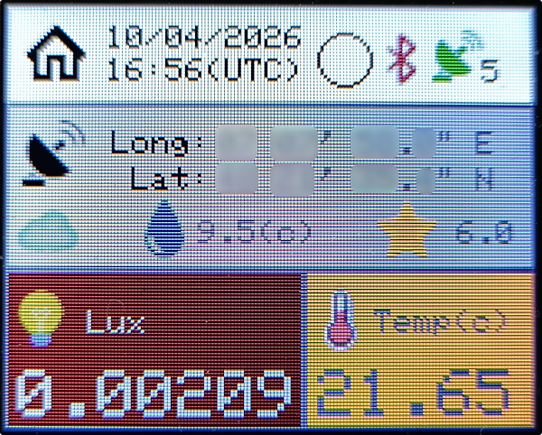

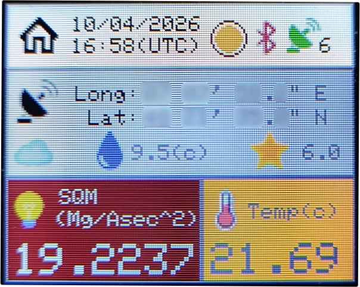

<a href="#sommaire">Retour au sommaire</a>

#### Ecran Luminosité

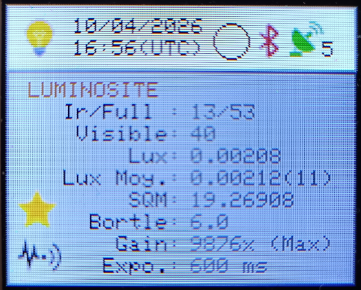

L'écran Luminosité comprend les éléments suivants :
- La luminosité mesurée totale et dans les Infrarouge.
- La luminosité mesurée dans le visible.
- La quantité de Lux issue des mesures Ir et Full.
- La quantité de Lux sur une moyenne mobile. Le nombre de mesures permettant de calculer la moyenne est entre parenthèse. Le nombre maximum de valeurs pour le calcul de la moyenne mobile est de 50 (ce nombre est modifiable dans le fichier de configuration via la constante `TSL2591_MOVING_AVERAGE_COUNT`).
- Le SQM (Mag / Arcsec²) calculé à partir du Lux moyen.
- Le Bortle issu de la valeur du SQM calculé.
- Le gain du capteur lors de la dernière mesure de luminosité effectuée.
- Le temps d'exposition du capteur lors de la dernière mesure de luminosité effectué.

> [!NOTE]
> Le gain et le temps d'exposition du capteur sont réglé automatiquement par le firmware afin d'avoir les valeurs les plus appropriées en fonction du contexte.

> [!IMPORTANT]
> Pour réinitialiser la moyenne mobile effectuée sur la mesure de Lux, il suffit d'effectuer un clic sur le joystick.

<a href="#sommaire">Retour au sommaire</a>

#### Ecran Environnement

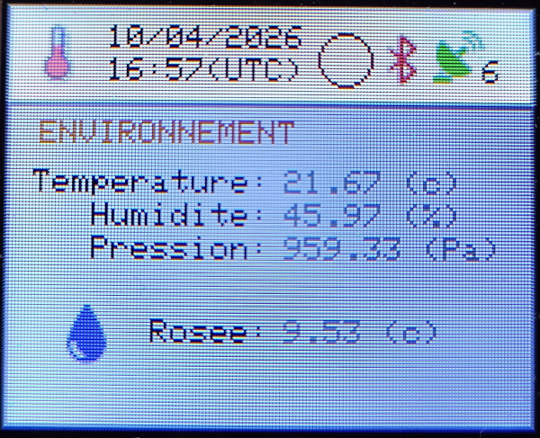

L'écran Environnement comprend les éléments suivants :
- La température ambiante (°C).
- Le taux d'humidité (%).
- La pression atmosphérique (Pa).
- Un icone représentant le point de rosée ainsi que la température du point de rosée. L'icone à trois états :
    - Bleu : pas de risque de rosée.
    - Orange : point de rosée à moins de 5°c de la température ambiante, risque de buée imminente.
    - Rouge : point de rosée atteint, pare-buée obligatoire.

<a href="#sommaire">Retour au sommaire</a>

#### Ecran Ir Température

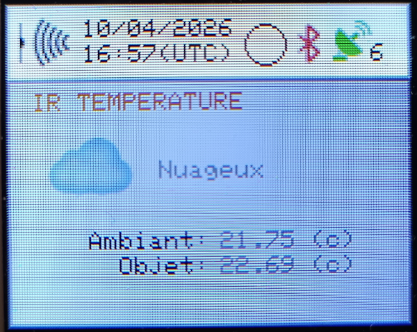

L'écran Ir Température permet d'afficher l'état du ciel. Il comprend les éléments suivants :
- Un icone représentant l'état du ciel. L'icone à trois états : 
    - Ciel clair.
    - Peu nuageux.
    - Nuageux.
- La température ambiante mesurée.
- La température de l'objet mesurée.

<a href="#sommaire">Retour au sommaire</a>

#### Ecran Niveaux

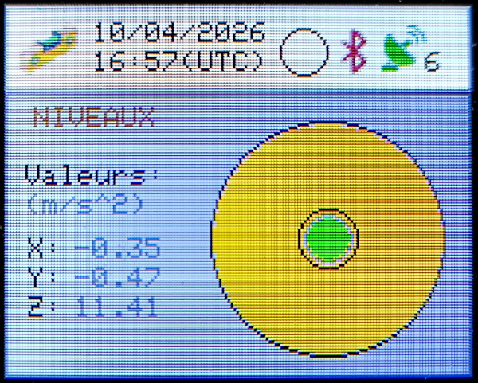

L'écran Niveaux permet d'afficher un niveau à bulle afin de positionner correctment le capteur de luminosité au zénith. Il comprend les éléments suivants :
- Un niveau à bulle de forme circulaire.
- L'accélération en X (m / s²).
- L'accélération en Y (m / s²).
- L'accélération en Z (m / s²).

<a href="#sommaire">Retour au sommaire</a>

#### Ecran GPS

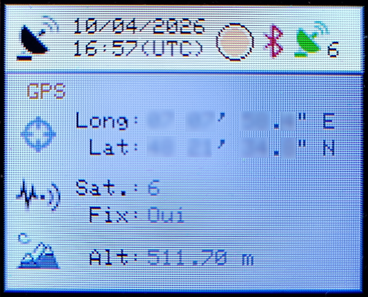

L'écran GPS permet d'afficher les données issues du GPS. Il comprend les éléments suivants :
- Les coordonnées en degrés, minutes, secondes et dizaines de secondes, orientation, en longitude et latitude.
- Le nombre de sattelites à partir desquels le capteur GPS récupère les informations.
- L'état "fixé" ou non.
- L'altitude courante (m).

<a href="#sommaire">Retour au sommaire</a>

## Driver ASCOM

*TODO*