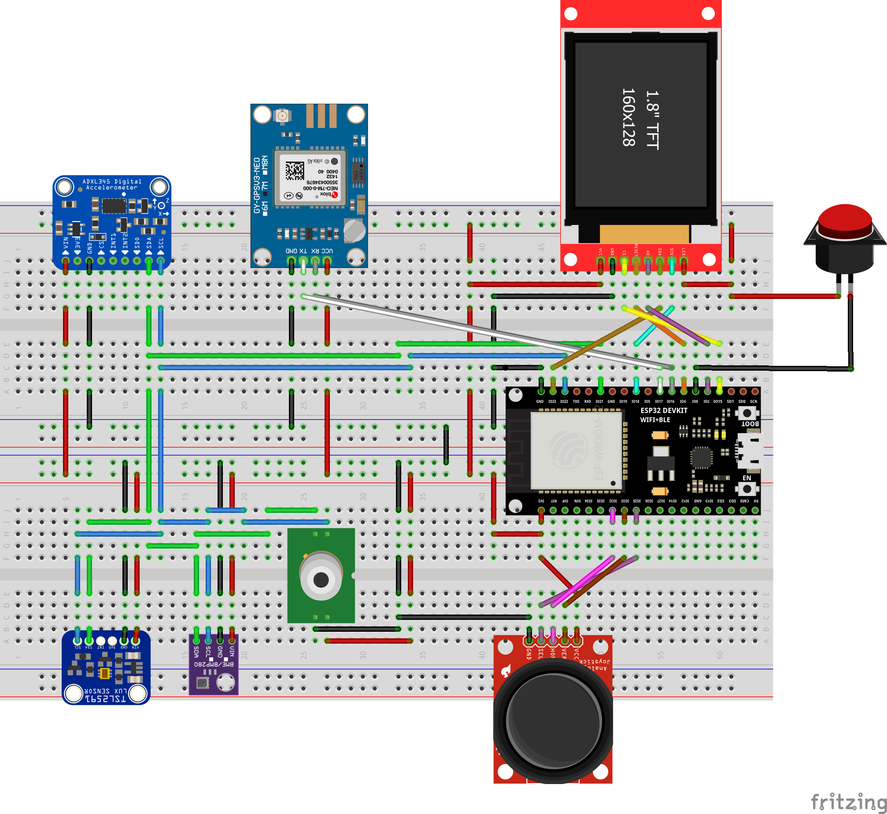
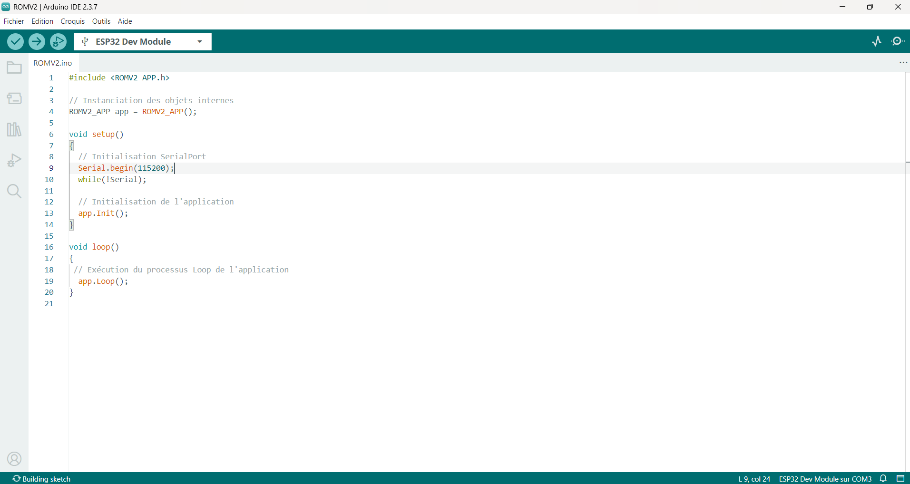

# ROMV2
## Description
Le ROMV2 est un Sky Quality Meter (SQM) contenant les composants suivant :
- TSL2591
- MLX90614
- BME280
- ADXL345
- GPS NEO 7M
- TFT ST7735

## Vidéos

## Branchements

## Liste des pièces
### Amazon

| Composant | Prix | Nb. pièces | Prix unitaire |
| --- | --- | --- | --- |
| [ESP32 with Battery](https://www.amazon.fr/dp/B07YXFBFWF) | 18.77 € | 1 | 18.77 € |
| [TSL2591](https://www.amazon.fr/dp/B00XW2OFWW) | 15.10 € | 1 | 15.10 € |
| [BME280](https://www.amazon.fr/dp/B07HMQMW6M?th=1) | 30.99 € | 5 | 6.20 € |
| [ADXL345](https://www.amazon.fr/ADXL345-Acc%C3%A9l%C3%A9rom%C3%A8tres-Acc%C3%A9l%C3%A9rom%C3%A8tre-Num%C3%A9rique-Transmission/dp/B0CMHXKVFK/ref=sr_1_10) | 10.56 € | 5 | 2.12 € |
| [MLX90614](https://www.amazon.fr/dp/B07YXFKRQS) | 33.49 € | 2 | 16.75 € |
| [GPS NEO 7M](https://www.amazon.fr/RELAND-SUN-NEO6MV2-NEO-6M-Contr%C3%B4leur/dp/B09VH4SND5/ref=sr_1_7) | 7.97 € | 1 | 7.97 € |
| [TFT ST7735](https://www.amazon.fr/AZDelivery-TFT-Compatible-Raspberry-incluant/dp/B07TJGF8HS/ref=sr_1_1) | 27.99 € | 5 | 5.60 € |
| [Joystick](https://www.amazon.fr/Gebildet-Joystick-Commande-Contr%C3%B4leur-Raspberry/dp/B0DPMN19G6/ref=sr_1_1_sspa) | 10.99 € | 8 | 1.37 € |
| [Boot Button](https://www.amazon.fr/dp/B07S1MNB8C) | 10.99 € | 5 | 2.20 € |
| | | Total | **76.08 €** |

### Ali Express
| Composant | Prix | Nb. pièces | Prix unitaire |
| --- | --- | --- | --- |
| [ESP32 with Battery](https://fr.aliexpress.com/item/1005007579177706.html) | 4.19 € | 1 | 4.19 € |
| [TSL2591](https://fr.aliexpress.com/item/1005009290610834.html) | 4.19 € | 1 | 4.19 € |
| [BME280](https://fr.aliexpress.com/item/1005010256393146.html?spm=a2g0o.productlist.main.2.78b7sYvrsYvrNW&aem_p4p_detail=202601100917361994442904015680011727029&algo_pvid=664d5010-2f7d-4243-b81e-0bd71b7036e1&algo_exp_id=664d5010-2f7d-4243-b81e-0bd71b7036e1-1&pdp_ext_f=%7B%22order%22%3A%2213%22%2C%22eval%22%3A%221%22%2C%22fromPage%22%3A%22search%22%7D&pdp_npi=6%40dis%21EUR%213.03%212.99%21%21%2124.07%2123.73%21%40211b615317680654560714990e4974%2112000051694170064%21sea%21FR%210%21ABX%211%210%21n_tag%3A-29910%3Bd%3A268baa35%3Bm03_new_user%3A-29895&curPageLogUid=KpQ950JoFBly&utparam-url=scene%3Asearch%7Cquery_from%3A%7Cx_object_id%3A1005010256393146%7C_p_origin_prod%3A&search_p4p_id=202601100917361994442904015680011727029_1) | 2.99 € | 1 | 2.99 € |
| [ADXL345](https://fr.aliexpress.com/item/1005007076396937.html?spm=a2g0o.productlist.main.2.1b7178978prMu0&aem_p4p_detail=20260110092034382346930602350009392653&algo_pvid=979b2a20-a6c3-436e-a181-ca2a512da107&algo_exp_id=979b2a20-a6c3-436e-a181-ca2a512da107-1&pdp_ext_f=%7B%22order%22%3A%2210%22%2C%22eval%22%3A%221%22%2C%22fromPage%22%3A%22search%22%7D&pdp_npi=6%40dis%21EUR%212.04%210.99%21%21%2116.18%217.85%21%4021039a5b17680656340051574e6e31%2112000039321883527%21sea%21FR%210%21ABX%211%210%21n_tag%3A-29910%3Bd%3A268baa35%3Bm03_new_user%3A-29895%3BpisId%3A5000000197682679&curPageLogUid=0sydmJMToagN&utparam-url=scene%3Asearch%7Cquery_from%3A%7Cx_object_id%3A1005007076396937%7C_p_origin_prod%3A&search_p4p_id=20260110092034382346930602350009392653_1) | 2.04 € | 1 | 2.04 € |
| [MLX90614](https://fr.aliexpress.com/item/1005005964068723.html?spm=a2g0o.productlist.main.4.2da25a797lce6r&algo_pvid=96472eaa-5bcc-412b-9cea-689f60105c19&algo_exp_id=96472eaa-5bcc-412b-9cea-689f60105c19-3&pdp_ext_f=%7B%22order%22%3A%2270%22%2C%22eval%22%3A%221%22%2C%22fromPage%22%3A%22search%22%7D&pdp_npi=6%40dis%21EUR%215.93%211.93%21%21%216.74%212.19%21%40211b876e17680657663371515e4d86%2112000035077198277%21sea%21FR%210%21ABX%211%210%21n_tag%3A-29910%3Bd%3A268baa35%3Bm03_new_user%3A-29895%3BpisId%3A5000000197682679&curPageLogUid=nmUgJJeUAuYu&utparam-url=scene%3Asearch%7Cquery_from%3A%7Cx_object_id%3A1005005964068723%7C_p_origin_prod%3A) | 5.93 € | 1 | 5.93 € |
| [GPS NEO 7M](https://fr.aliexpress.com/item/1005006323393609.html?spm=a2g0o.productlist.main.3.5baaF3dXF3dXN6&algo_pvid=d358f8e7-a8c4-4330-bd75-5c9c0d9cf0fd&algo_exp_id=d358f8e7-a8c4-4330-bd75-5c9c0d9cf0fd-2&pdp_ext_f=%7B%22order%22%3A%2243%22%2C%22spu_best_type%22%3A%22price%22%2C%22eval%22%3A%221%22%2C%22fromPage%22%3A%22search%22%7D&pdp_npi=6%40dis%21EUR%213.69%210.99%21%21%2129.30%217.85%21%40211b6c1717680658512117875e9001%2112000036760961133%21sea%21FR%210%21ABX%211%210%21n_tag%3A-29910%3Bd%3A268baa35%3Bm03_new_user%3A-29895%3BpisId%3A5000000197682689&curPageLogUid=795nKb0Msi8Z&utparam-url=scene%3Asearch%7Cquery_from%3A%7Cx_object_id%3A1005006323393609%7C_p_origin_prod%3A) | 4.63 € | 1 | 4.63 € |
| [TFT ST7735](https://fr.aliexpress.com/item/1005008974306385.html?spm=a2g0o.productlist.main.1.69deN3sMN3sMCK&aem_p4p_detail=20260110092555980857702899360011928963&algo_pvid=6bee107f-34fa-4179-b0e6-e06063f523cd&algo_exp_id=6bee107f-34fa-4179-b0e6-e06063f523cd-0&pdp_ext_f=%7B%22order%22%3A%22201%22%2C%22eval%22%3A%221%22%2C%22fromPage%22%3A%22search%22%7D&pdp_npi=6%40dis%21EUR%213.20%210.99%21%21%2125.40%217.84%21%402103847817680659550071490e715d%2112000047425743978%21sea%21FR%210%21ABX%211%210%21n_tag%3A-29910%3Bd%3A268baa35%3Bm03_new_user%3A-29895%3BpisId%3A5000000197682689&curPageLogUid=xHHqy2YoAtyq&utparam-url=scene%3Asearch%7Cquery_from%3A%7Cx_object_id%3A1005008974306385%7C_p_origin_prod%3A&search_p4p_id=20260110092555980857702899360011928963_1) | 3.20 € | 1 | 3.20 € |
| [Joystick](https://fr.aliexpress.com/item/1005009123774307.html?spm=a2g0o.productlist.main.2.844571abghArQ0&aem_p4p_detail=202601100928134145830235804040011530309&algo_pvid=89fbdaf8-fb4d-49ac-9e4e-6c98ab33126b&algo_exp_id=89fbdaf8-fb4d-49ac-9e4e-6c98ab33126b-1&pdp_ext_f=%7B%22order%22%3A%22158%22%2C%22eval%22%3A%221%22%2C%22fromPage%22%3A%22search%22%7D&pdp_npi=6%40dis%21EUR%210.51%210.51%21%21%210.58%210.58%21%402103956b17680660932575051e4923%2112000047996600701%21sea%21FR%210%21ABX%211%210%21n_tag%3A-29910%3Bd%3A268baa35%3Bm03_new_user%3A-29895&curPageLogUid=1X7S3y0vz51t&utparam-url=scene%3Asearch%7Cquery_from%3A%7Cx_object_id%3A1005009123774307%7C_p_origin_prod%3A&search_p4p_id=202601100928134145830235804040011530309_1) | 0.51 € | 1 | 0.51 € |
| [Boot Button](https://fr.aliexpress.com/item/1005007876916629.html?spm=a2g0o.productlist.main.10.73ef397fSy3LUu&aem_p4p_detail=202601100929212620692040343560011023458&algo_pvid=85067849-ce96-40d4-bcf8-23d93fe938f9&algo_exp_id=85067849-ce96-40d4-bcf8-23d93fe938f9-9&pdp_ext_f=%7B%22order%22%3A%2214%22%2C%22eval%22%3A%221%22%2C%22fromPage%22%3A%22search%22%7D&pdp_npi=6%40dis%21EUR%217.89%217.89%21%21%2162.62%2162.62%21%40211b819117680661610895672e553c%2112000042664114951%21sea%21FR%210%21ABX%211%210%21n_tag%3A-29910%3Bd%3A268baa35%3Bm03_new_user%3A-29895&curPageLogUid=isVvfGSpx5wR&utparam-url=scene%3Asearch%7Cquery_from%3A%7Cx_object_id%3A1005007876916629%7C_p_origin_prod%3A&search_p4p_id=202601100929212620692040343560011023458_10) | 6.69 € | 5 | 1.34 € |
| | | Total | **29.02 €** |

## Firmware

- Télécharger le fichier **ROMV2_LIB.zip**
- Depuis votre Arduino IDE, installer la bibliothèque **ROMV2_LIB** via le menu : \
Croquis -> Importer une bibliothèque -> Ajouter la bibliothèque .ZIP ...

### Bibliothèques nécessaires à l'application
Voici la liste des bibliothèques utilisées par l'application que vous devez installer via le gestionnaire de librairies dans votre Arduino IDE :

- Adafruit_TSL2591
- Adafruit_BME280
- Adafruit_MLX90614
- Adafruit_ADXL345
- TFT_eSPI

### Configuration de l'application
Vous pouvez accéder à la configuration de l'application via le fichier suivant : \
\<*Arduino librairies*\> -> ROMV2 -> src -> **ROMV2_APP_CONFIG.h**

### Configuration de l'écran TFT ST7735
Afin de faire fonctionner votre écran, il vous sera nécessaire de le configurer via la bibliothèque **TFT_eSPI** en modifiant le fichier suivant : \
\<*Arduino librairies*\> -> TFT_sSPI -> **User_Setup.h**

Vous devez modifier 2 paramètres :

- La sélection de votre écran :

- Les PINs associés à votre écran :

### Implémentation
Pour démarrer un nouveau projet ROMV2, il vous suffit d'aller dans les examples de votre Arduino IDE, et de sélectionner **ROMV2**.

### Mode \"Debug\"
Pendant le développement de votre projet, vous pouvez activer le mode **Debug**. Afin d'améliorer les performances, **n'oubliez pas de le désactiver une fois le fois le projet abouti**. \

Dans le fichier suivant : \
\<*Arduino librairies*\> -> ROMV2 -> src -> **JUANITO_APP.h** \
Enlevez les commentaires devant la ligne : \
`#define DEBUG`

En activant le mode **Debug**, vous pourrez voir les traces de l'application dans le *Moniteur série* de votre *Arduino IDE* pendant l'exécution. 

## Driver ASCOM
